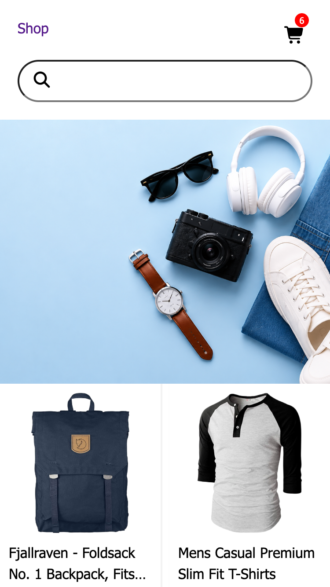
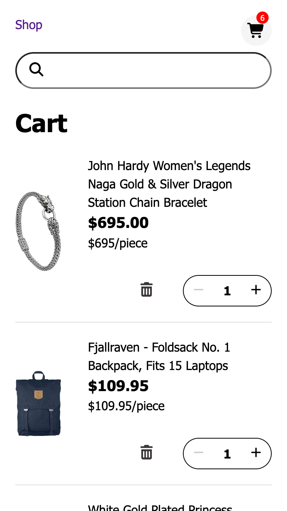

# ShopLite

A responsive e-commerce frontend built with React.

🔗 Live Demo: https://shoplite-beta.vercel.app

## Demo

 &nbsp;&nbsp; 

## Overview

Users can browse products, view product details, manage their cart, and keep it across page refreshes.

## Features

- Browse products and view product details
- Manage shopping cart (add, update quantity, remove items)
- Persist shopping cart with localStorage
- Responsive layouts for desktop and mobile

## Tech Stack

- React
- React Router
- JavaScript (ES6+)
- CSS3
- Vite

## Challenges

- HTML input constraints (min/max) do not prevent invalid React state updates, so I implemented custom validation for quantity inputs.
- As the application grew, I lifted cart state and update logic into the App component while keeping child components focused on rendering and user interactions.
- Building layouts that work across different screen sizes required combining Flexbox, CSS Grid, and CSS variables.

## What I Learned

- Managing shared state with a single source of truth
- Building controlled inputs with custom validation instead of relying on HTML constraints
- Separating UI concerns from business logic to make components easier to maintain
- Choosing readability over premature optimization
- Designing responsive layouts with CSS Grid and Flexbox

## Reflection

Building this project taught me much more than implementing an e-commerce interface. It helped me develop a better understanding of React state management, component responsibilities, and how to balance clean architecture with practical development. Most importantly, I learned to focus on building complete, maintainable features instead of optimizing too early.

## Future Improvements

- Improve accessibility and semantic HTML
- Improve product search with debounced input
- Add debounced quantity input for a smoother editing experience
- Remove cart items automatically when quantity reaches zero
- Add toast notifications after adding items to the cart
- Add user authentication and checkout flow
